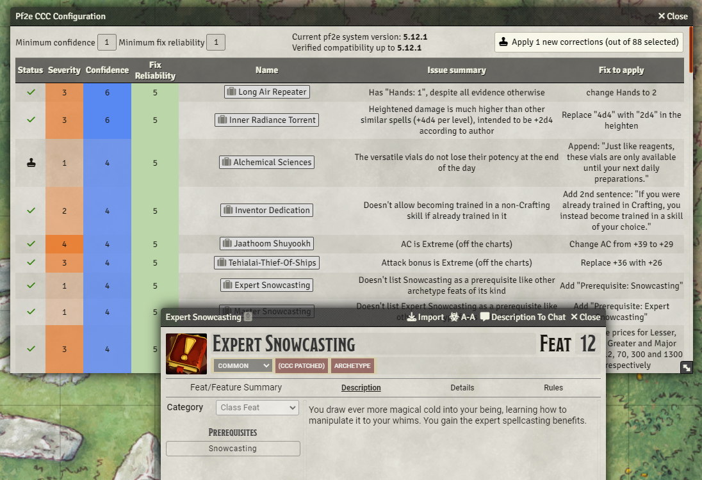
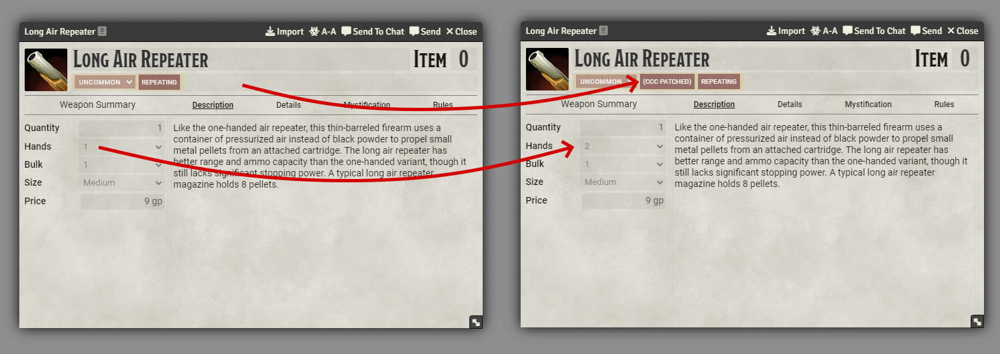

# [Pf2e Crowdsourced Community Corrections](https://foundryvtt.com/packages/pf2e-crowdsourced-community-corrections/)

FoundryVTT module for the PF2e system, which applies community-sourced corrections to pf2e compendiums.

To install, [directly copy the manifest link for the latest release](https://github.com/shemetz/pf2e-crowdsourced-community-corrections/releases/latest/download/module.json).

# [Source of data - collaborative spreadsheet](https://docs.google.com/spreadsheets/d/1nZ95fXqnmutFx8HE8TLvJIFiRf3WN9EwkBv7yYLFdB4)

# Features

This module is in **ALPHA** state, functional and somewhat stable but not pretty.

When enabled, open the settings and find the Corrections Menu inside the module settings. That menu opens up a big
mini-spreadsheet where you can choose your minimum numbers to filter through the list, and then can click a button to
apply the corrections (patching a few dozen compendium entries).

This will last until a system update, which will revert these changes and require doing it again (potentially also
requiring this module to update and avoid breaking things).

If you like this module, please leave feedback on the github or on
[the discord thread](https://discord.com/channels/880968862240239708/1189157820680114256); I might develop it more if
you do!

# Screenshots

# Roadmap

- Add backups or ability to revert patches (perhaps by storing the original altered field in a flag)
- Automatically apply after pf2e system updates/migrations
- Apply patches to imported things too
- Apply patches within character and NPC sheets too

# Licensing
To the best of my understanding, no special licensing is required for this module;  it does not contain any full content
from any Paizo book.  It only contains brief snippets of content - "patches" to override bits and pieces of content in
the official pf2e system, which is a separate package.
